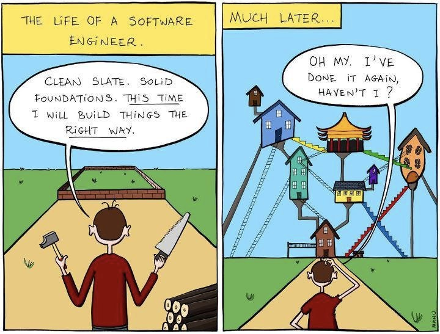
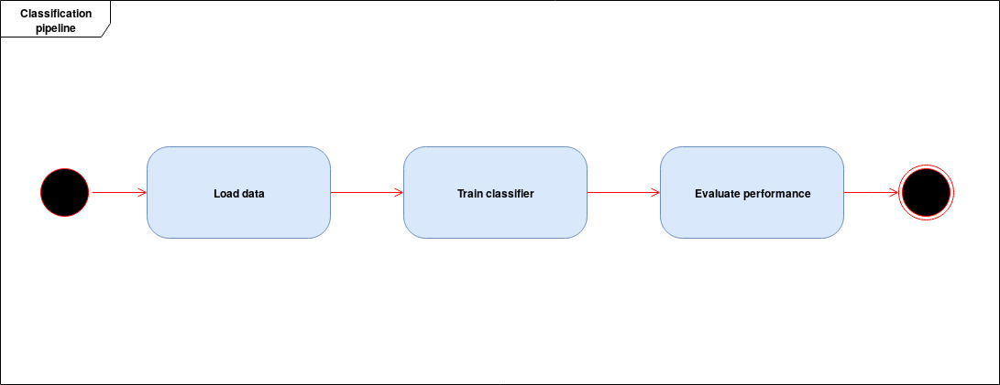
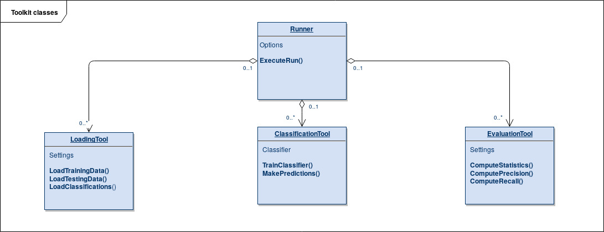

<!-- $theme: gaia -->
<!-- $size: 16:9 -->

#### Toolkit for malware classification
##### Lukáš Sahula

---
<!-- page_number: true -->
#### Something to break the ice

---

#### Classification pipeline

	

---

#### Toolkit classes

	

---

#### Evaluation metrics

	

---

#### Baseline model

 
<table align="center">
<thead>
<tr>
<td bgcolor="#2F2F2F">Avg precision</td>
<td bgcolor="#2F2F2F">Avg recall</td>
<td bgcolor="#2F2F2F">TPs</td>
<td bgcolor="#2F2F2F">FPs</td>
<td bgcolor="#2F2F2F">FNs</td>
</tr>
</thead>
<tbody>
<tr>
<td align="right">0.28</td>
<td align="right">0.31</td>
<td align="right">174</td>
<td align="right">561</td>
<td align="right">533</td>
</tr>
</tbody>
</table>
 
<table align="center">
<thead>
<tr>
<td bgcolor="#2F2F2F"># of classes</td>
<td bgcolor="#2F2F2F">with precision >=</td>
</tr>
</thead>
<tbody>
<tr>
<td align="right">10</td>
<td align="right">1.00</td>
</tr>
<tr>
<td align="right">10</td>
<td align="right">0.95</td>
</tr>
<tr>
<td align="right">10</td>
<td align="right">0.90</td>
</tr>
<tr>
<td align="right">12</td>
<td align="right">0.80</td>
</tr>
<tr>
<td align="right">19</td>
<td align="right">0.50</td>
</tr>
</tbody>
</table>

---

#### Future work
1. Implementing random forest
2. Dealing with missing values
3. Beating the baseline model