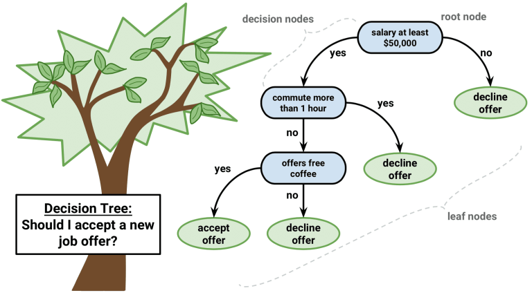
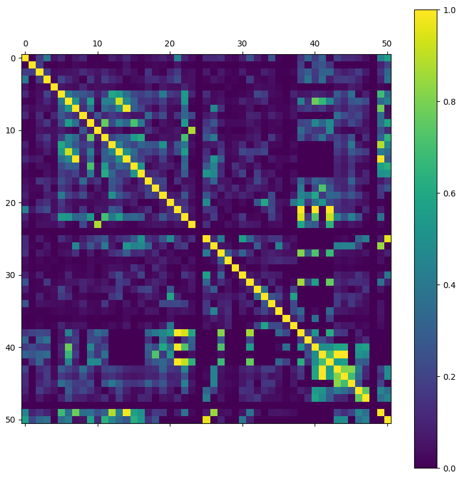
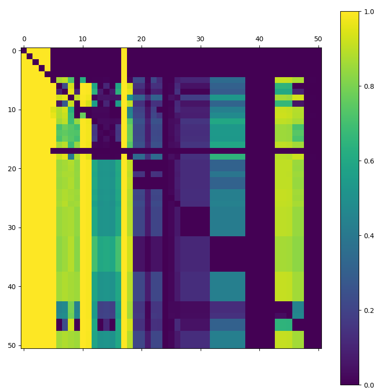
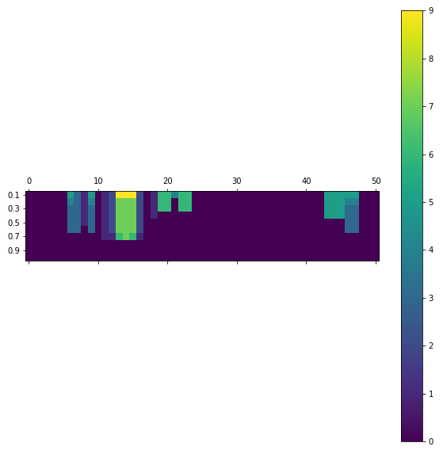
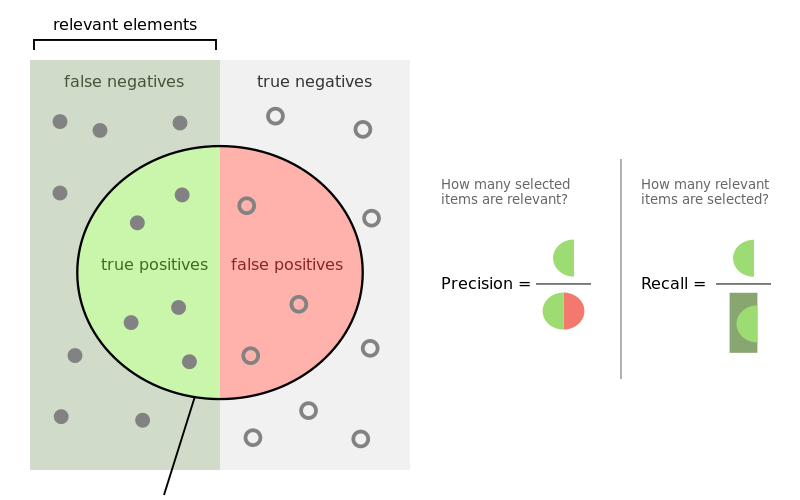

<!-- $theme: gaia -->
<!-- $size: 16:9 -->

  

---

  
Random forest, <b>source:</b> http://blog.yhat.com

---

 
<h3 align="center">Handling Missing Values in Decision Forests</h3>
<h3 align="center">in the Encrypted Network Traffic</h3>
 
 

	Author: Lukáš Sahula  
	Supervisor: Ing. Jan Brabec  
	Bachelor thesis    
    Czech Technical University in Prague  
    Faculty of Electrical Engineering  
    Department of Computer Science  

---

<!-- page_number: true -->
### Handling missing values...
 
 
<table align="center">
<thead>
<tr>
<td bgcolor="#2F2F2F">Name</td>
<td bgcolor="#2F2F2F">Animal</td>
<td bgcolor="#2F2F2F">Age</td>
<td bgcolor="#2F2F2F">Gender</td>
<td bgcolor="#2F2F2F">Description</td>
</tr>
</thead>
<tbody>
<tr>
<td align="right">Rex</td>
<td align="right">Dog</td>
<td align="right">3</td>
<td align="right">Male</td>
<td align="right">A good boy</td>
</tr>
<tr>
<td align="right">Lady</td>
<td align="right">Dog</td>
<td align="right" style="color: red;">X</td>
<td align="right">Female</td>
<td align="right" style="color: red;">X</td>
</tr>
<tr>
<td align="right">Cat</td>
<td align="right">Cat</td>
<td align="right">4</td>
<td align="right">Male</td>
<td align="right" style="color: red;">X</td>
</tr>
<tr>
<td align="right">Kitty</td>
<td align="right">Cat</td>
<td align="right" style="color: red;">X</td>
<td align="right">Female</td>
<td align="right">Likes to cuddle</td>
</tr>
<tr>
<td align="right">Gizmo</td>
<td align="right" style="color: red">X</td>
<td align="right" style="color: red;">X</td>
<td align="right">Male</td>
<td align="right" style="color: red;">X</td>
</tr>
</tbody>
</table>

---

### ... in Decision Forests ...

	  
    Decision Tree classifier, <b>source:</b> http://packtpub.com

---

### ... in the Encrypted Network Dataset
- Data from network proxy logs
- Classification of malware 
- Over 100 classes of malware
- 50 features
- Data missingness over 50%

---

### Dataset correlation analysis

	  
    Heatmap of feature pairs correlations (Pearson)

---

### Conditional probabilities of missingness

	  
    P(i_missing | j_not_missing)

---

### Feature substitution

	  
	Feature pairs with PCC above 0.3

---

### Existing methods for missing data imputation
- <b>Baseline</b>
- <b>Strawman imputation (mean or median)</b>
- <b>On-the-fly-imputation method</b>
- <b>Missingness incorporated in attributes</b>
- MissForest
- Surrogate splits
- ...

---

### Evaluation metrics

	  
    Precision and recall, <b>source:</b> http://wikipedia.org

---

### Experiments with random forests
- Number of trees: 100
- Minimal number of samples for a split: 2
- Maximal number of features for a split: sqrt
- Maximal depth of trees: unlimited
- Trained on data from three days in January 2017
- Tested on data from one day in March 2017
- Randomness factor: 1% of variance in recall and precision

---

### Results
 
<table align="center">
<thead>
<tr>
<td bgcolor="#2F2F2F">Method</td>
<td bgcolor="#2F2F2F">Precision</td>
<td bgcolor="#2F2F2F">Recall</td>
<td bgcolor="#2F2F2F">Prec = 1.0</td>
<td bgcolor="#2F2F2F">Prec > 0.8</td>
<td bgcolor="#2F2F2F">Prec > 0.5</td>

</tr>
</thead>
<tbody>
<tr>
<td align="right">Baseline</td>
<td align="right">0.61</td>
<td align="right">0.57</td>
<td align="right">22</td>
<td align="right">54</td>
<td align="right">70</td>
</tr>
<tr>
<td align="right">Mean</td>
<td align="right">0.59</td>
<td align="right">0.54</td>
<td align="right">21</td>
<td align="right">54</td>
<td align="right">70</td>
</tr>
<tr>
<td align="right">Median</td>
<td align="right">0.56</td>
<td align="right">0.49</td>
<td align="right">19</td>
<td align="right">45</td>
<td align="right">65</td>
</tr>
<tr>
<td align="right">OTFI</td>
<td align="right" style="color: red">0.23</td>
<td align="right" style="color: red">0.06</td>
<td align="right" style="color: red">18</td>
<td align="right" style="color: red">25</td>
<td align="right" style="color: red">25</td>
</tr>
<tr>
<td align="right">MIA</td>
<td align="right" style="color: blue">0.65</td>
<td align="right" style="color: blue">0.58</td>
<td align="right" style="color: blue">28</td>
<td align="right" style="color: blue">60</td>
<td align="right" style="color: blue">74</td>
</tr>
</tbody>
</table>

Average precision, recall, and number of classes with precision above a certain threshold

---

### Contributions
- Correlation of datasets features analysed
- Algorithms compared on real data
- On-the-fly-imputation found not suited for data with heavy missingness
- Missingness incorporated in attributes slightly improves the baseline method
- Python framework for further experiments implemented

---

### Answers
#### Method speed comparison
- Baseline: ~18 hours
- Strawman: ~18 hours
- MIA: ~45 hours
- OTFI: ~100 hours

